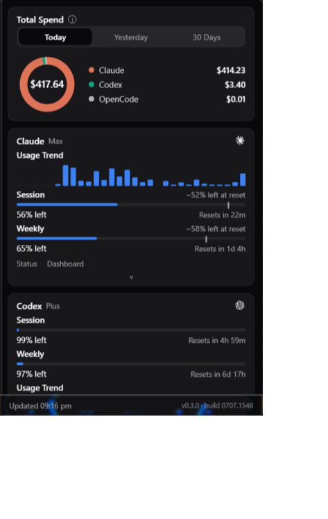
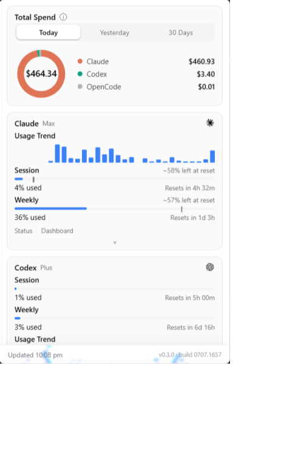

<div align="center">

# Pane

**All your AI subscription limits in one liquid-glass tray popover for Windows.**

One click on the tray icon answers the questions every AI power user keeps
asking: *How much of my Claude session is left? When does my Codex weekly
reset? What did today actually cost me?*

[Install](#install) · [How it works](#how-it-works) · [Providers](#providers-18-and-counting) · [Features](#features) · [Privacy](#privacy) · [Credits](#credits)

&nbsp;&nbsp;

</div>

---

## Why Pane

If you use AI coding tools seriously, you're juggling half a dozen separate
subscriptions — Claude Max, ChatGPT/Codex, Copilot, Cursor, and whatever
else this month brought. Each one hides its limits behind its own dashboard,
counts in its own units, and resets on its own schedule. The only time you
find out you're running low is when you hit the wall mid-task.

Pane puts all of them in one place, in your system tray, refreshed every few
minutes, with pace warnings *before* you hit the wall. It started as a
Windows rebuild of the excellent [OpenUsage for macOS](https://github.com/robinebers/openusage)
by [Robin Ebers](https://github.com/robinebers) and is growing into a
broader AI-workflow companion from there.

## Install

### Installer (recommended)

1. Grab **`Pane_x.y.z_x64-setup.exe`** from the
   [latest release](https://github.com/ItsJazii/pane/releases/latest).
2. Run it. Pane installs per-user to `%LOCALAPPDATA%\Pane` — no admin
   rights needed.
3. Look for the Pane icon in the system tray (next to the clock). Click it.

> **SmartScreen note:** the installer isn't code-signed yet, so Windows may
> show "Windows protected your PC." Click **More info → Run anyway**. Code
> signing is on the roadmap.

Silent install (for scripts): `Pane_x.y.z_x64-setup.exe /S`

### winget *(coming soon)*

Once Pane has its first public release, it will be submitted to the winget
community repo so this works:

```
winget install ItsJazii.Pane
```

### Build from source

Prerequisites: Node.js 20+, Rust (stable-msvc), Visual Studio C++ Build
Tools, WebView2 (bundled with Windows 11).

```
git clone https://github.com/ItsJazii/pane
cd pane
npm install
npm run tauri dev     # run with hot reload
npm run tauri build   # installer lands in src-tauri/target/release/bundle
```

## How it works

Pane is a small Tauri v2 app: a Rust core doing the data work, a vanilla
TypeScript UI doing the glass. No Electron, no background services — one
~10 MB process idling around 90 MB of RAM.

**1. Finding your accounts.** The official CLIs and editors you already use
keep their login tokens in well-known per-user locations — Claude Code
writes `%USERPROFILE%\.claude\.credentials.json`, Codex CLI writes
`%USERPROFILE%\.codex\auth.json`, the GitHub CLI stores its token in
Windows Credential Manager, and so on. Pane reads those same files (or
takes an API key you paste into Settings) and shows a card for every tool
it finds. Tools it can't find start disabled — no dead cards.

**2. Asking the vendors.** Every few minutes, each provider's token is sent
to **its own vendor's API only** — the exact usage endpoints the vendors'
own apps use — and the card updates with sessions, weekly windows, credit
balances, and reset times. Expired OAuth tokens are refreshed and written
back, which keeps your CLIs signed in too. Failing providers get benched
briefly and their last good data is shown with an "Outdated" tag instead of
a blank card.

**3. Pacing the burn.** Every metric with a reset window gets a projection:
if you keep burning at this rate, will you make it to the reset? Bars turn
amber/red as the math worsens and optional Windows toasts fire once per
reset window ("Almost out", "Will run out").

**4. Counting the money.** Your CLIs already log every request locally.
Pane scans those logs (Claude, Codex, Grok, OpenCode, Cursor CSV), prices
each request with live per-model rates (LiteLLM / models.dev, refreshed
daily), and draws the Today / Yesterday / 30-day donut with a per-model
breakdown. On a flat-rate plan this shows what your usage *would* cost at
API prices — the best ad for your subscription you'll ever see. Events for
models without a known price are excluded and flagged, never guessed.

**5. Staying local.** All of the above happens on your machine. There is no
Pane server, no account, and no telemetry — see [Privacy](#privacy).

## Providers (18 and counting)

| Provider | How Pane connects |
|---|---|
| Claude (Claude Code) | `%USERPROFILE%\.claude\.credentials.json` + Anthropic usage API |
| Codex (Codex CLI) | `%USERPROFILE%\.codex\auth.json` + ChatGPT usage API, incl. reset-credit redemption |
| Cursor | Cursor's local state database + cursor.com API |
| OpenCode (Go plan) | Local `opencode.db` spend vs documented plan limits* |
| GitHub Copilot | Copilot editor login or GitHub CLI (Credential Manager) + GitHub API |
| Grok (Grok CLI) | `%USERPROFILE%\.grok\auth.json` + Grok billing API |
| Devin (Devin CLI) | `%APPDATA%\devin\credentials.toml` + GetUserStatus RPC |
| MiniMax | API key (Settings, env var, or CLI config) + token-plan API |
| OpenRouter | API key (Settings) or key stored by OpenCode |
| Z.ai | API key (Settings), CLI key file, or env var |
| Antigravity | Local language server, or Google Cloud Code API via Credential Manager |
| DeepSeek | API key (Settings) → balance |
| Moonshot (Kimi) | API key (Settings) → balance (global + CN endpoints) |
| ElevenLabs | API key (Settings) → character quota with reset pacing |
| Ollama | Local server on :11434 — installed + loaded models, no key |
| Codebuff | `codebuff login` credentials file or API key → credits + weekly limit |
| Kilo | Kilo CLI login file or API key → credit blocks + Kilo Pass |
| Kiro *(experimental)* | Reads `kiro-cli /usage` output → credits + bonus credits |

*OpenCode has no public usage API yet
([anomalyco/opencode#10448](https://github.com/anomalyco/opencode/issues/10448));
usage is computed locally from this machine's OpenCode history, the same
data `opencode stats` uses.

More on the way: IDE-database providers (Windsurf, JetBrains AI…) and
whatever the community asks for loudest.

## Features

- **Pace projections** — colored bars and "will run out" warnings based on
  your burn rate within each reset window, plus optional Windows toasts.
- **Local spend** — Today / Yesterday / 30 Days donut with per-model
  breakdown and a 30-day trend, priced with live model rates.
- **Codex reset credits** — see each banked credit's exact expiry and
  redeem it with one click.
- **Live tray numbers** — star up to two metrics per provider and they
  render as logo + percentage pairs directly in the tray.
- **Customize** (☰) — reorder providers and metrics by drag, hide rows,
  tuck rarely-needed ones behind an "On Demand" caret. Ctrl+Z undoes.
- **Liquid glass UI** — real SDF lens refraction on the auto-hiding
  sidebar and glass bars, magnetic minimap trail, circular day/night wipe.
- **Share cards** — hover a card, click ⧉, paste the PNG anywhere.
- **Quick links** — Status / Dashboard shortcuts on every card.
- **Local HTTP API** — `GET http://127.0.0.1:6736/v1/usage` for scripts,
  Rainmeter widgets, stream overlays; same wire format as the Mac app.
- **Appearance** — System / Light / Dark, compact density, global shortcut
  (e.g. `Ctrl+Shift+U`), optional outbound proxy.

## Privacy

- **Zero telemetry.** Pane phones home to nobody — there is no "home".
- **Tokens never leave their lane.** Each vendor's credential is sent only
  to that vendor's own API, over HTTPS, and nowhere else.
- **Keys stay on this PC** in `%APPDATA%\Pane`, readable only by your
  Windows user.
- **Spend accounting is local.** Your usage logs are parsed on your
  machine; only anonymous price-table downloads (LiteLLM/models.dev) touch
  the network, and those are one-way.
- The local HTTP API binds to `127.0.0.1` only — nothing on your network
  can reach it.

## Settings (gear icon)

Refresh interval · Start with Windows · tray metric picker · appearance &
compact density · time format · global shortcut · notification toggles ·
outbound proxy · API keys.

## Credits

Pane exists because of
**[OpenUsage for macOS](https://github.com/robinebers/openusage)** by
**[Robin Ebers](https://github.com/robinebers)** (MIT). The hard part of a
tool like this — knowing which credential files to read, which
undocumented usage endpoints to call, and how to interpret their
responses — is research Robin did first and published openly. Pane is an
independent from-scratch rebuild for Windows (Rust + TypeScript instead of
Swift), but it stands on that research and gladly says so. If you're on a
Mac, use his app.

Additional thanks:

- [Tauri](https://tauri.app/) — the app shell that keeps Pane tiny.
- [prasen.dev](https://www.prasen.dev/) — the original SDF liquid-glass
  lens technique the UI's refraction is ported from.
- [LiteLLM](https://github.com/BerriAI/litellm) and
  [models.dev](https://models.dev/) — open model-price catalogs powering
  the spend engine.
- [shadcn/ui](https://ui.shadcn.com/) — the zinc design tokens the theme
  is built on.

Pane is not affiliated with or endorsed by Robin Ebers or any of the AI
vendors listed. Provider names and logos belong to their respective owners
and are used only to identify the services.

## License

[MIT](LICENSE) — © 2026 Jazii, with provider research credit to Robin
Ebers' OpenUsage (MIT).
