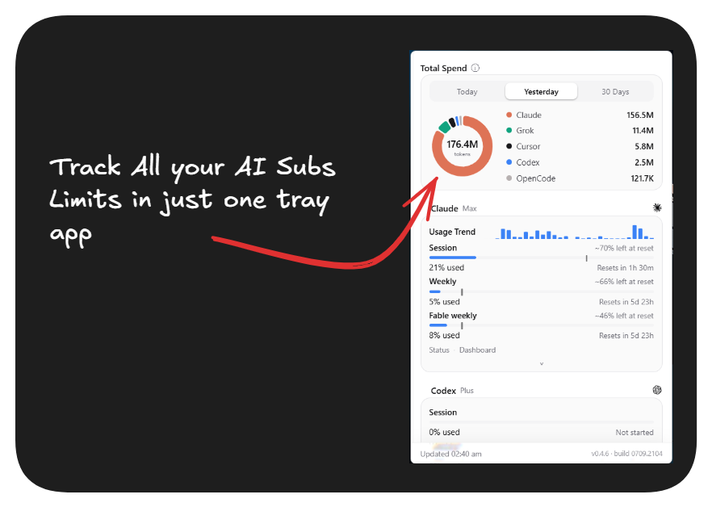

<div align="center">

# Pane

[English](README.md) · **简体中文** · [Русский](README.ru.md)

**Pane：在 Windows 托盘中查看所有 AI 套餐与订阅。**

点击托盘图标，就能回答每个 AI 重度用户常遇到的问题：*我的 Claude 会话额度还剩多少？Codex 每周额度何时重置？今天实际花了多少钱？*

Pane 是 [OpenUsage](https://www.openusage.ai/) 的 Windows 版本：一款免费的 AI 套餐用量追踪工具，支持 Claude、Codex、Cursor、Copilot、Kimi、Grok 等 24 个服务商。

**[trypane.xyz](https://trypane.xyz)** · [指南](https://trypane.xyz/guides) · [安装](#安装) · [工作原理](#工作原理) · [服务商（24 个且持续增加）](#服务商24-个且持续增加) · [功能](#功能) · [隐私与安全](#隐私与安全) · [致谢](#致谢)



</div>

---

## 为什么选择 Pane

如果你经常使用 AI 编程工具，可能同时订阅了 Claude Max、ChatGPT/Codex、Copilot、Cursor，以及其他新服务。每项服务都把额度藏在各自的控制台里，计量单位和重置时间也各不相同。往往等到任务进行到一半碰壁时，你才发现额度见底了。

Pane 把这些信息集中到系统托盘，每隔几分钟刷新一次，并在额度耗尽前给出消耗速度预警。它最初是 [Robin Ebers](https://github.com/robinebers) 出色的 macOS 应用 [OpenUsage](https://github.com/robinebers/openusage) 的 Windows 重建版本，此后逐步扩展为更全面的 AI 工作流助手。

## 安装

每个发布版本的安装包都由 GitHub Actions 直接从对应标签的源码构建并发布，构建日志公开，来源可核验。

### winget（推荐）

```
winget install Pane.Pane
```

Pane 已收录在 [Microsoft 官方 winget 社区仓库](https://github.com/microsoft/winget-pkgs/tree/master/manifests/p/Pane/Pane)：经过审核与哈希校验，不会触发 SmartScreen 提示。

### 一行命令（PowerShell）

```powershell
irm https://trypane.xyz/install.ps1 | iex
```

此命令会下载最新版本、校验 SHA-256、为当前用户安装 Pane（无需管理员权限），然后启动应用。不会触发 SmartScreen 提示。

将在线脚本直接传给 PowerShell，会立即执行服务器当时返回的内容。如果想先检查脚本，可以分两步运行：

```powershell
iwr https://trypane.xyz/install.ps1 -OutFile install.ps1
# 先阅读 install.ps1；这是一个简短且带注释的脚本，然后运行：
powershell -ExecutionPolicy Bypass -File .\install.ps1
```

（也可以直接使用上面的 `winget install Pane.Pane`：Microsoft 的构建流程会校验哈希。）

### 安装程序（.exe）

1. 从[最新版本](https://github.com/ItsJazii/pane/releases/latest)下载 **`Pane_x.y.z_x64-setup.exe`**。
2. 运行安装程序。Pane 会安装到 `%LOCALAPPDATA%\Pane`，无需管理员权限。
3. 在时钟旁的系统托盘中找到 Pane 图标，点击即可打开。

> **SmartScreen 提示：**安装程序尚未进行代码签名，因此 Windows 可能显示“Windows 已保护你的电脑”。点击**更多信息 → 仍要运行**。代码签名已列入开发计划。

静默安装（供脚本使用）：`Pane_x.y.z_x64-setup.exe /S`

无论采用哪种安装方式，Pane 都会检查已签名的更新；有新版本时，可点击一次按钮重启并完成更新。

### 从源码构建

前置条件：Node.js 20+、Rust（stable-msvc）、Visual Studio C++ Build Tools、WebView2（Windows 11 已内置）。

```
git clone https://github.com/ItsJazii/pane
cd pane
npm install
npm run tauri dev     # 热重载开发运行
npm run tauri build   # 安装包位于 src-tauri/target/release/bundle
```

## 工作原理

Pane 是一款轻量的 Tauri v2 应用：Rust 核心负责数据处理，原生 TypeScript 界面负责玻璃质感的视觉效果。它不使用 Electron，也不运行后台服务；是一个约 10 MB 的单进程应用，空闲时内存占用约 90 MB。

**1. 发现你的账户。** 你使用的官方 CLI 和编辑器会把登录凭据保存在当前用户目录下的固定位置：Claude Code 使用 `%USERPROFILE%\.claude\.credentials.json`，Codex CLI 使用 `%USERPROFILE%\.codex\auth.json`，GitHub CLI 将令牌保存在 Windows 凭据管理器中，其他工具也类似。Pane 读取这些文件；你也可以在设置中粘贴 API Key。它会为发现的每个工具显示卡片，未发现的工具默认禁用，不会出现没有数据的卡片。

**2. 查询服务商。** 每隔几分钟，Pane 仅将各服务商的令牌发送到**对应服务商自己的 API**，调用其应用使用的用量接口，更新会话、每周额度窗口、余额和重置时间。过期的 OAuth 令牌会刷新并写回，因此对应 CLI 也能保持登录。服务商请求失败时，Pane 会暂时停止请求，并显示上次成功获取的数据及“数据过时”标记，而不是留下一张空白卡片。

**3. 预测额度消耗。** 对于有重置周期的指标，Pane 会推算：按照当前速度使用，额度能否撑到重置？情况变差时，进度条会变为琥珀色或红色。可选的 Windows 通知会在每个重置周期提示“即将用完”“将会用完”，或在每周额度重置时提示“额度已重置”。

**4. 统计花费。** 你的 CLI 已在本地记录每次请求。Pane 扫描这些日志（Claude、Codex、Grok、OpenCode、Devin CLI、Cursor CSV、MiniMax CLI、Kimi Code、Qwen Code、pi 编程代理及其 oh-my-pi / Step Code 分支、Hermes 桌面应用），按实时模型单价计费（LiteLLM / models.dev 每天更新；存在未知模型时每小时更新，让新模型的价格能在一小时内被识别），绘制今天、昨天和最近 30 天的花费圆环图，并按模型拆分。点击圆环可在金额和 Token 数之间切换。对于固定价格的套餐，这里显示的是按 API 价格计算的*等效费用*，能直观看出订阅的价值。没有公开价格的模型仍会计入实测 Token 数，但不会猜测金额；服务商花费行的 ⚠ 表示实际费用可能高于显示值。

**5. 数据留在本机。** 上述处理都在你的电脑上完成。无需注册账户，额度、花费和服务商数据不会离开电脑。Pane 只会报告两类匿名的自身信息：更新检查（按国家或地区统计，不存储 IP），以及每日一次的匿名统计（始终开启，应用内没有关闭开关；包括随机 ID、版本、已启用的服务商及请求成功/失败次数，不包含额度数值或错误文本）。完整约定请参阅[隐私与安全](#隐私与安全)。

## 服务商（24 个且持续增加）

| 服务商 | Pane 的连接方式 |
|---|---|
| Claude（Claude Code） | `%USERPROFILE%\.claude\.credentials.json` + Anthropic 用量 API；支持多账户，每个发现的配置目录登录账户对应一张卡片；附 Cloud 云端会话额度条（按到期日倒数）以及可一键领取的已存速率限制重置额度 |
| Codex（Codex CLI） | `%USERPROFILE%\.codex\auth.json` + ChatGPT 用量 API，包括重置额度兑换；与 Claude 一样支持多账户 |
| Cursor | Cursor 本地状态数据库 + 新版用量 RPC；RPC 主机无法访问时，`cursor.com/api/usage-summary` 仍可更新套餐进度条 |
| OpenCode（Go 套餐） | 官方账户级用量 API（从 `auth.json` 获取 Go Key）；本地 `opencode.db` 用于统计花费* |
| GitHub Copilot | Copilot 编辑器登录凭据或 GitHub CLI（凭据管理器）+ GitHub API |
| Grok（Grok CLI） | `%USERPROFILE%\.grok\auth.json` + Grok 账单/订阅 API |
| Devin（Devin CLI） | `%APPDATA%\devin\credentials.toml` + GetUserStatus RPC；本地 CLI 会话记录用于统计花费 |
| MiniMax | API Key（设置、环境变量或 CLI 配置）+ Token 套餐 API |
| OpenRouter | API Key（设置）或 OpenCode 保存的 Key |
| Z.ai | API Key（设置）、CLI Key 文件或环境变量 |
| Antigravity | 本地语言服务器，或通过凭据管理器访问 Google Cloud Code API |
| DeepSeek | API Key（设置）→ 余额 |
| StepFun | API Key（设置，未配置时回退到 Step Code 保存的 `platform_*` Key）→ 余额、抵用券和已用额度；Step Plan 套餐档位在设置中手动选用；`step-*` 花费从 Claude Code / Codex / OpenCode / oh-my-pi / Step Code 记录归集 |
| Kimi API | 平台 API Key（设置）→ 钱包余额和已用额度（支持国际站与中国站接口） |
| Kimi Code | 官方 CLI 登录（`kimi login`）或粘贴 Kimi For Coding 套餐 Key → 会话及每周额度进度条、会员名称（Moderato / Allegretto / Allegro / Vivace）；可选显示 Kimi API 钱包余额；统计本地会话花费 |
| ElevenLabs | API Key（设置）→ 字符额度及重置进度预测 |
| Ollama | 本地 `:11434` 服务 → 已安装及已加载的模型，无需 Key |
| Codebuff | `codebuff login` 凭据文件或 API Key → 积分和每周额度 |
| Kilo | Kilo CLI 登录文件或 API Key → 积分包和 Kilo Pass |
| AihubMix | API Key（设置或从 OpenCode 自动发现）→ 用量与花费上限对比 |
| One/New API | 在设置中添加多个兼容站点及每站多个 Key；每个 Key 对应一张额度卡片，密钥仅在本机供文件所有者读取 |
| Sub2API | 在“设置 → Sub2API”中添加多个站点及每站多个 Key；每个 Key 对应一张卡片，数据来自该站点的 `GET /v1/usage`；密钥仅本机文件所有者可读，只发送到配置的站点源地址 |
| Qwen Code | Coding Plan Key（设置或环境变量）→ 5 小时、每周、每月请求额度及本地花费 |
| Hermes | 本地账本 `%LOCALAPPDATA%\hermes\state.db` → 最近使用的两个模型、路由及按模型目录价格计算的花费，包括限定场景下的 AihubMix 启动模型价格 |

*OpenCode 的额度指标使用 [anomalyco/opencode#16513](https://github.com/anomalyco/opencode/pull/16513) 引入的官方用量 API，显示与 Zen 控制台相同的账户级数据。因此，其他设备（或共享订阅的其他人）的用量也会被计入。如果 API 无法访问，Pane 会改用本机 `opencode.db` 计算用量，与 `opencode stats` 使用的数据相同；金额统计始终来自本地。

后续计划支持更多基于 IDE 数据库的服务商（Windsurf、JetBrains AI 等），以及社区最需要的其他服务。

## 功能

- **Claude 和 Codex 多账户**：个人套餐和工作/企业账户可以同时使用。将第二个登录账户放在独立目录（通过 `CLAUDE_CONFIG_DIR` / `CODEX_HOME`），Pane 就会按账户显示各自独立的上限、套餐、额度与花费，并使用组织名或邮箱命名卡片（如“Claude — Acme”）。同一账户重复登录只显示一张卡片，不修改你现有的配置。
- **One/New API 站点**：在设置中添加多个兼容站点，每个站点可添加多个 Key。每个 Key 都有独立的额度卡片；密钥仅在这台电脑上供文件所有者读取，并只发送到配置的站点源地址。
- **英语、中文和俄语**：可手动选择语言，也可让“自动”模式使弹窗、托盘和额度通知跟随 Windows 显示语言。
- **额度消耗预测**：根据重置周期内的使用速度，显示彩色进度条和“将会用完”预警，并可选择接收 Windows 通知。
- **本地花费**：按实时模型单价计算今天、昨天和最近 30 天的花费，展示按模型拆分的圆环图和 30 天趋势。悬停扇区时，它会与图例对应行一起突出显示；点击圆环可在金额和 Token 数之间切换。
- **已存重置额度**：Claude 和 Codex 都会累积速率限制重置额度；查看每笔额度的准确到期时间，并一键兑换。
- **已签名的自动更新**：每次打开 Pane 时以及后台每隔 4 小时检查一次更新。新版本发布后，底部的版本号会变成“更新”按钮；点击后即可下载、验证签名并重启。更新检查与下载会走设置中的出站代理。
- **托盘实时数字**：每个服务商最多可加星两项指标，以图标和百分比组合直接显示在托盘中。
- **小组件模式**：在“设置 → 通用”中开启后，Pane 固定显示在屏幕上而不再自动隐藏：拖动顶部栏移动位置，用锁定按钮固定，点击折叠箭头可收缩为一条 40px 窄栏，每隔几秒轮播各服务商（主额度、剩余百分比、重置倒计时），最小化则收回托盘。开启“液态玻璃效果”时，折叠后的窄栏为半透明玻璃条，可直接透出桌面，无需 Windows 透明设置。
- **自定义**：直接在卡片上拖动任意指标行即可调整顺序，包括移入和移出展开的“按需查看”区域（Esc 取消）；拖动卡片把手调整卡片顺序；也可打开“自定义”页面（☰）调整指标顺序、隐藏行，或把不常用的项目收进折叠区域。按 Ctrl+Z 可撤销。
- **液态玻璃界面**：自动隐藏侧边栏和玻璃进度条使用真正的 SDF 透镜折射，并提供磁性缩略导航轨迹及日夜模式圆形切换效果。
- **分享卡片**：悬停卡片并点击 ⧉，即可复制粘贴到其他地方。复制内容与卡片显示一致（包括进度条、消耗提示和趋势；按钮与链接会被移除），并带有 Pane 图标和标语。
- **快捷链接**：每张卡片都提供状态（Status）与控制台（Dashboard）快捷跳转入口。
- **[本地 HTTP API](docs/local-http-api.md)**：脚本、Rainmeter 小组件或直播叠加层可调用 `GET http://127.0.0.1:6736/v1/usage`。接口格式与 macOS 应用相同，但不发送 CORS 标头，并只接受本机回环 Host，网页无法通过浏览器读取，即使通过 DNS 重绑定也不行。
- **外观与设置**：系统/浅色/深色主题、紧凑密度、全局快捷键（如 `Ctrl+Shift+U`）及可选的出站代理。

## 隐私与安全

Pane 会读取凭据文件。你不必只凭我们的描述相信它会妥善处理这些文件，可以自行核查：

- **[docs/privacy.md](docs/privacy.md)**：列出 Pane 可能发起的所有网络请求。没有事件流、会话录制或自动捕获。更新检查会按国家或地区统计匿名的每日安装量（不存储 IP）；始终开启的每日匿名统计使用与其他信息无关联的随机 ID，仅报告版本、已启用服务商及刷新成功/失败次数。该文档逐字段解释完整约定。
- **[docs/providers.md](docs/providers.md)**：逐一列出每个服务商会读取你电脑上的哪些文件，以及凭据会发送到哪些接口。
- **[SECURITY.md](SECURITY.md)**：说明如何私密报告漏洞、可从源码审查的安全属性，以及当前限制（安装程序未签名；发布包本身由 GitHub Actions 从对应标签源码构建，构建日志公开）。

简而言之：令牌仅通过 HTTPS 发送到对应服务商自己的 API；粘贴的 Key 存在 `%APPDATA%\Pane`，仅 Windows 当前用户可读取；花费数据仅在本地解析本地日志；HTTP API 仅在回环地址提供服务，不设置 CORS，并检查 Host；更新会验证签名。

## 设置（齿轮图标）

语言（自动/English/中文/Русский）· 刷新间隔 · 随 Windows 启动 · 小组件模式 · 液态玻璃效果 · 托盘指标选择 · 外观与紧凑密度 · 时间格式 · 全局快捷键 · 通知开关 · 出站代理 · 服务商 API Key · One/New API 与 Sub2API 站点及 Key 管理。

## 致谢

Pane 的诞生离不开 **[Robin Ebers](https://github.com/robinebers)** 开发的 **[macOS 版 OpenUsage](https://github.com/robinebers/openusage)**（MIT）。这类工具最难的部分，是弄清该读取哪些凭据文件、调用哪些未公开的用量接口，以及如何解释返回的数据。Robin 率先完成研究并将成果公开。Pane 是使用 Rust 和 TypeScript（而非 Swift）为 Windows 从头独立重建的应用，但仍建立在这些研究之上，并乐于明确致谢。如果你使用 Mac，请使用他的应用。

另外感谢：

- [Tauri](https://tauri.app/)：让 Pane 保持轻量的应用框架。
- [prasen.dev](https://www.prasen.dev/)：界面折射效果移植自其最初设计的 SDF 液态玻璃透镜技术。
- [LiteLLM](https://github.com/BerriAI/litellm) 和 [models.dev](https://models.dev/)：为花费统计提供模型价格目录。
- [shadcn/ui](https://ui.shadcn.com/)：主题使用的 zinc 设计变量来源。

Pane 与 Robin Ebers 或所列 AI 服务商不存在关联，也未获得他们的认可。服务商名称和标识仅用于识别对应服务。

## 许可证

[MIT](LICENSE) — © 2026 Jazii；服务商相关研究归功于采用 MIT 许可证的 Robin Ebers OpenUsage。
